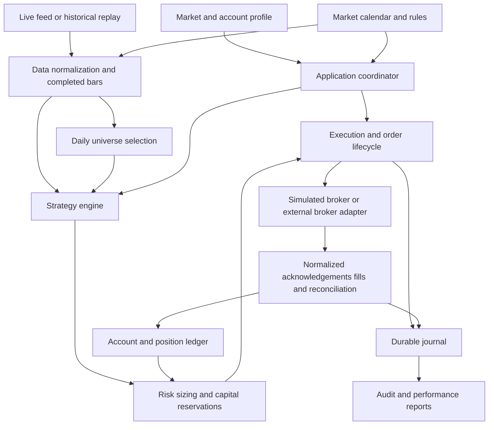

# Architecture plan: one application, multiple markets

Status: proposed implementation design, 2026-09-07. This document does not claim these components already exist. The current runnable build remains the offline foundation described in README.md.

## Decision

Use a **modular monolith**: one Java codebase, one build, one executable JAR and one process for the first India trading account. Modules are Java packages with explicit interfaces; they are not independently deployed services. Keep the application headless with a CLI and local reports initially.

The expected workload is a small equity universe, at most 10-20 shortlisted instruments, minute-based signals and a small number of positions. This does not justify distributed infrastructure. Measure feed lag, queue depth and memory before buying more computing capacity.

When adding US trading, reuse the sam9e application with another market profile and a broker adapter. Initially run a separate instance of that same JAR for each account/market, with its own state directory and capital allocation. This isolates failures, authentication and trading sessions without creating different applications. Do not run multiple writers against the same account: enforce an exclusive account lock, and reconcile any externally placed orders.

No web framework, message broker, Kubernetes, Redis or hosted database is required. Do not create a Maven multi-module project yet. Separate build modules only if compile-time boundaries become difficult to maintain or components develop genuinely different release cycles.

## Logical layout

The arrows describe logical communication within one process, apart from the external broker/feed connection. The strategy emits a signal; the execution module decides how that becomes an order after risk approval. Strategies never call an SDK.

## Modules and ownership

| Java package | Owns | Must not own |
| --- | --- | --- |
| `domain` | Instrument identities, Money, quantities, bars, signals, orders, executions, positions | SDK classes, credentials, files, fixed India time |
| `market` | Calendar, session windows, instrument rules and tradability policies | Strategy logic, network order submission |
| `data` | Feed normalization, bar construction, freshness and gap checks | Buy/sell decisions, broker positions |
| `universe` | Daily eligible universe and optional sector ranking | Orders, hindsight-based selection |
| `strategy` | ORB and future signal rules | Account balances, exchange-specific order strings |
| `risk` | Quantity sizing, pending/open risk, account and sector limits | Broker calls, fill assumptions |
| `execution` | Intent validation, order lifecycle, exit coordination, reconciliation | Predicting price direction |
| `portfolio` | Account-scoped execution ledger, positions, realized and unrealized P&L | Fabricated fills, strategy-specific market rules |
| `ports` | Small interfaces for external data, broker, calendar and storage access | Concrete infrastructure |
| `adapters.kite` | Kite SDK authentication, requests and response translation | Shared strategy logic |
| `adapters.simulation` | Fill/cost simulation for replay and paper modes | Claims of realistic fills without an explicit model |
| `adapters.files` | Historical files, journal and report exports | Trading decisions |
| `app` | Composition, CLI, configuration, lifecycle, scheduler and event dispatch | Duplicated strategy or accounting algorithms |

All SDK interaction stays inside its adapter. India integrations must continue to use the Kite SDK as required by AGENTS.md. Java standard-library interfaces and manual constructor wiring are enough; no dependency-injection framework is needed.

## Interfaces to implement first

These are proposed contracts, not existing callable APIs. Keep the surface small; add methods when a tested use case requires them.

| Interface | Responsibility |
| --- | --- |
| `TradingClock` | Provide current `Instant`; replay supplies a controllable clock |
| `MarketCalendar` | Resolve a venue/session date to opening, closing and exceptional windows |
| `InstrumentCatalog` | Resolve stable instrument IDs, point-in-time metadata and provider identifiers |
| `MarketDataSource` | Publish normalized market events with provenance and freshness information |
| `HistoricalDataSource` | Iterate timestamped records without exposing future records to strategy code |
| `BrokerGateway` | Submit/cancel orders; query orders, executions, positions and account capabilities |
| `TradingPolicy` | Validate instrument/account eligibility, supported orders, quantity increments and session permission |
| `Strategy` | Consume a closed bar and read-only context; return zero or more signals |
| `Journal` | Persist versioned order intents and state-changing events and replay them |
| `CostModel` | Estimate dated fees and execution costs for a particular market/account |

A broker gateway is not a data source. Some brokers supply both; keep the interfaces separate so a later data vendor does not require changing execution code. Preserve raw provider payloads for audit where appropriate, while keeping normalized fields in the domain.

## What is shared between India and US trading

Shared: event processing, candle mechanics, ORB calculation, risk reservations, position accounting, order state transitions, recovery workflow, backtest orchestration and reporting structure.

Configured or supplied: exchange calendar, timezone, currency, broker identifiers, instrument metadata, account restrictions, order capabilities, short eligibility, fee models and data semantics. Broker selection for the US is deferred; the adapter must be validated against the selected broker and account rather than assumed interchangeable.

| Concern | India profile | Future US profile | Core design |
| --- | --- | --- | --- |
| Time | `Asia/Kolkata` | `America/New_York` for the chosen US regular session | `Instant` in events; named zones in calendars |
| Calendar | Venue-specific holidays and special sessions | Venue-specific holidays and early closes | Versioned calendar provider, not weekday-only checks |
| Currency | INR account initially | USD account initially | Money always carries a currency |
| Broker | Kite SDK | Selected broker adapter | No broker SDK types outside adapter |
| Product | Adapter maps intent to eligible Kite product such as MIS | Adapter maps to its own account/order fields | Intraday intent is portable; MIS is not |
| Quantity | Whole equity shares initially | Whole shares initially; fractional support only if explicitly enabled | Decimal-capable quantity plus metadata-driven increment validation |
| Routing | Broker-specific exchange/symbol | Broker-specific routing fields | Listing venue and execution route are separate concepts |
| Data | Snapshot/cumulative-volume semantics | Provider-dependent trades, quotes or bars | Explicit event type and volume semantics |
| Costs and eligibility | Dated India/account policy | Dated US/account policy | Separate models; no shared hardcoded fee or margin assumptions |

NYSE documents both core session hours and early closing days. Therefore time windows must come from the calendar, not a universal fixed UTC offset. See [NYSE hours and calendars](https://www.nyse.com/trade/hours-calendars).

Alpaca's order documentation, used here only as an example of a future broker, describes different order attributes and eligibility such as extended-hours handling. This supports capability validation at the adapter boundary; it is not a recommendation or a broker selection. See [Alpaca orders](https://docs.alpaca.markets/us/docs/orders-at-alpaca).

### Session-relative strategy settings

Define the first strategy using durations relative to the regular open:

- Opening range: open through open + 15 minutes.
- Last permitted entry observation: strictly before open + 45 minutes.
- Flatten starts: open + 60 minutes, or the calendar's closing safety deadline if earlier.
- Continue reconciliation and exit handling until confirmed flat with no remaining entry/exit orders.

This expresses the same experiment in either market without placing `09:15` or `09:30` inside ORB. Whether it performs well in the US requires its own backtest. Extended-hours and special-session trading remain disabled until separately supported.

## Domain decisions that prevent an expensive rewrite

### Stable identity

Use an internal `InstrumentId` for a particular listing or derivative contract. Store listing venue, asset class, quote currency, symbol history and effective dates. Store broker tokens in a separate mapping keyed by provider, venue, instrument and validity period. Include external identifiers where available; do not pretend a display ticker identifies every listing uniquely.

For options later, add underlying ID, expiry, strike, put/call, exercise/settlement metadata and contract multiplier. Never globally assume a particular option lot size or multiplier. Keep the initial production scope to equities.

This changes the current foundation's token-keyed position design. That design solved mismatched symbols in the prototype, but tokens must not become permanent identities in historical storage. Kite explicitly warns that derivative instrument tokens can be reused after expiry. See [Kite instrument documentation](https://kite.trade/docs/connect/v3/market-quotes/).

### Time and data

Store `eventTime` and `receivedTime` as `Instant`. Derive local session dates through the market calendar. Include interval, source, completion/quality status and adjustment policy in bar records. Keep raw and corporate-action-adjusted datasets distinguishable. Use named timezone rules for DST.

Candle construction must distinguish trade quantities, cumulative-volume snapshots and provider-supplied bars. A quote update is not necessarily a trade. Porting a data feed must not mean renaming fields and assuming equal semantics. Gaps, stale input and conflicting history/live overlap must produce explicit quality decisions; they must not silently modify an already-traded signal.

### Amounts, account identity and positions

Use decimal money/quantities at ledger and order boundaries (`BigDecimal` is available in the JDK), with explicit currency, rounding and quantity-increment rules. Indicators may retain floating-point calculations where tested. Convert final prices using the instrument's permitted tick rules rather than a universal 0.05 buffer.

Key positions by account, instrument and any broker-required inventory/product bucket. Keep strategy attribution in executions/trades rather than pretending that the broker maintains separate positions for every strategy. V1 permits one strategy owner per instrument/account. P&L from INR and USD accounts is reported separately; consolidated currency reporting later needs dated FX inputs. No automatic cross-account capital transfers are planned.

### Intent versus broker order

A signal carries instrument, direction, observation time and strategy context. An order intent adds account, approved quantity, price constraints, session scope and risk reservation. The adapter converts this into supported broker fields. Unsupported capability combinations fail validation; they are not silently downgraded.

All broker updates are normalized before the ledger sees them. An adapter using cumulative fills and one providing execution IDs must converge to the same account state under the same economic fills. Broker acknowledgement, execution and cancellation confirmation remain different events.

## Runtime and failure handling

One event-loop owner mutates trading state for an account. Network callbacks put events in bounded queues and return promptly. A small I/O executor performs blocking broker/file operations and returns results as events. No thread is needed for every stock, strategy or indicator.

Preserve source ordering and execution identifiers. Use exchange timestamps for bar windows with a documented lateness policy; do not sort all live events by wall-clock timestamp and assume this resolves broker causality. Protect order/fill/control events from dropping. Queue overload or stale data halts new entries and raises an operator-visible event. Reconciliation and position protection remain active.

Lifecycle:

`STARTING -> RECONCILING -> READY -> OBSERVING -> TRADING -> MANAGING -> FLATTENING -> FINISHED`

Any phase can enter `HALTED` or `RECOVERY_REQUIRED`. Halting entries must not disable management of open positions. Empty calendars, missing mappings, stale balances or unresolved orders prevent READY. FINISHED means confirmed flat and no outstanding orders, not merely that the intended stop time arrived.

Before sending an order:

1. Validate signal age, instrument/account eligibility and capabilities.
2. Reserve cash and worst-case planned risk, including pending orders.
3. Assign and durably persist a unique client intent ID and submission intent.
4. Submit through the adapter and persist acknowledgements/executions.
5. Release or adjust reservations as actual fills/cancellations resolve.

If submission times out, the order may already exist. Enter an unknown-submission state and reconcile using available broker references. Never automatically resend an uncertain order just because HTTP failed. A local ID alone does not provide broker-side idempotency or exactly-once execution.

After restart, replay the local journal, query broker state, compare positions/open orders/executions, and resolve differences before enabling new entries. Detect manual broker activity as a discrepancy requiring a defined policy. Stops/targets and exit cancellation races are an execution concern; software-only stops cannot protect a position while the machine is offline.

## Storage and inexpensive operation

Start with local historical files, a durable append-only event journal, and daily report files. Implement journal records with schema version, sequence, length and checksum using JDK facilities; force critical submission intent records to disk, and checkpoint state atomically. Test partial-write recovery, duplicate replay and disk-write failures. Halt new orders if durable intent storage fails. CSV is an export/data interchange format, not the order transaction journal.

A local SQLite implementation is a reasonable alternative when journal queries/recovery become cumbersome. It would require a JDBC dependency approval under this repository's rules. The `Journal` contract allows that substitution without changing strategies. No dependency is added by this plan.

Suggested runtime directories are separated by mode and account: historical data and versioned instrument/calendar snapshots; per-account execution journals; configuration snapshots excluding secrets; reports with run IDs. Backtest and paper artifacts must never be opened as live account state. Keep credentials external and logs redacted.

Use the existing computer initially, with sleep disabled during operation, reliable connectivity and measured resource usage. Live broker networking/authentication requirements must be satisfied separately. The previous review documented Kite's static-IP constraint. Recheck live requirements at integration time; architecture alone does not satisfy them. A later small dedicated machine can run the same JAR without redesign.

## Backtest, paper and live modes

All modes reuse strategy, market-policy, risk and accounting code. Composition selects clock, data source and execution adapter:

| Mode | Clock/data | Execution |
| --- | --- | --- |
| Backtest | Deterministic replay; point-in-time metadata | Explicit fill, latency and dated cost models |
| Paper | Live feed and clock | Simulated fills; separately recorded assumptions |
| Live | Live feed and clock | Real broker gateway with reconciliation |

A historical report records source/dataset hashes, calendar and instrument versions, strategy/configuration versions, cost model, trade ledger and rejected signals. Apply signals only after information became available. Broker order behaviour cannot be proved solely by a bar backtest: adapter contract tests and paper/controlled live validation remain separate.

## Migration from the current code

| Current component | Planned evolution |
| --- | --- |
| `Candle`, `TickData` | Remove automatic India timezone conversion; introduce neutral timestamps, instrument IDs and data semantics |
| `Instrument`, `InstrumentRegistry` | Separate stable identity from effective-dated provider mappings; add currency/tick/quantity metadata |
| `TradingSession` | Become calendar/profile implementation; eliminate static India constants from strategy/data consumers |
| `ORBStrategy` | Inject session windows and timing policy; retain pure signal output and existing behaviour tests |
| `TimeSeriesManager` | Inject calendar, session boundaries and feed-normalization rules |
| `PositionSizer`, `RiskManager` | Use money/currency, quantity rules and account-scoped reservations |
| `OrderManager` | Separate ledger and execution coordinator from simulation; remove hardcoded MIS from core |
| `TradingSystemMain` | Thin composition root selecting account/market/mode and starting coordinator |
| `RiskManagerThread` | Retire in favour of the account event-loop scheduler |
| Existing 46 checks | Preserve economic invariants; extend them for both profiles and recovery contracts |

Migrate incrementally. Do not copy the India engine into a US folder. Do not construct an empty US broker adapter and call it supported. A synthetic second-market fixture is enough to prove the architecture boundary before choosing a US broker.

## Implementation sequence and acceptance criteria

1. **Portable foundation.** Add neutral IDs/time/money, market profile/calendar and initial ports. Move current assumptions into an India profile. Acceptance: current India behaviour still passes; a synthetic US profile runs the same ORB code with different session/currency; DST, holiday and early-close fixtures pass without SDK/network dependencies.
2. **Offline coordinator and replay.** Compose the modules into one process; implement session lifecycle, capital reservations, historical ingestion, journal and report exports. Acceptance: repeatable India replay, no lookahead, no double allocation, timed entry cutoff and flattening, deterministic replay after restart.
3. **Kite paper integration.** Implement SDK adapter normalization, maintained metadata/calendar, authentication and reconciliation. Acceptance: disconnected/stale data, rejected/partial orders, submission uncertainty and broker-state mismatches all follow tested policies.
4. **India live readiness.** Add actual protective-order handling, restart/operator recovery and account limits. Acceptance: documented operational validation and explicit live configuration; strategy performance assessed independently.
5. **US expansion.** Select broker/data provider, implement adapter/calendar/rules/costs, and run the same contract/replay tests with US data. Acceptance: independent US backtest and execution validation; no modifications to ORB solely to translate broker fields.
6. **Options.** Add contract metadata and separate strategy/risk/execution behaviour only after equity stability. Multi-leg atomicity, assignment, expiry and margin require new work, not an exchange-string change.

## When to split into services

Consider extracting historical research first if backtests interfere with live latency: a separate process running the same application is often enough. Introduce independently deployed services only for measured requirements such as multiple concurrent account teams, a large continuously recorded universe, independent uptime/release needs, or an actual remote multi-user product.

Profit by itself is not a reason to add infrastructure. Operational requirements and measured bottlenecks should drive that decision.
